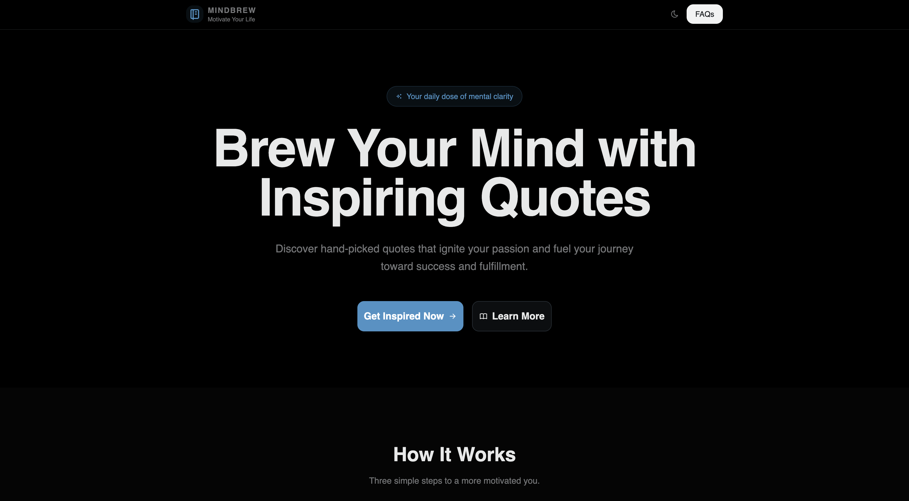

# MindBrew



MindBrew is the ultimate destination for daily motivation. Explore quotes on success, leadership, love, and perseverance to brew your mind for greatness.

## Features

- Daily inspirational quotes
- Categories: Success, Leadership, Love, Motivation, Perseverance, Self-Improvement, Focus, Happiness
- Share quotes on social media
- Responsive design
- Dark/Light mode

## Tech Stack

- **Frontend**: React 19
- **Build Tool**: Vite
- **Styling**: TailwindCSS
- **UI Components**: Radix UI (ShadCN)
- **Icons**: Tabler Icons
- **Routing**: React Router DOM

## Installation

1. Clone the repository:

   ```bash
   git clone https://github.com/zeropse/MindBrew.git
   cd mindbrew
   ```

2. Install dependencies:

   ```bash
   pnpm install
   ```

3. Start the development server:

   ```bash
   pnpm dev
   ```

4. Open [http://localhost:3000](http://localhost:3000) in your browser.

## Available Scripts

- `pnpm dev` - Start the development server
- `pnpm build` - Build the project for production
- `pnpm preview` - Preview the production build locally
- `pnpm lint` - Run ESLint for code linting

## Project Structure

```
src/
├── components/          # Reusable UI components
│   ├── ui/             # Shadcn/ui components
│   └── ...
├── data/               # Quote data files
├── layout/             # Layout components (Navbar, Footer)
├── lib/                # Utility functions
├── pages/              # Page components
└── style/              # Styling and theme files
```

## Contributing

Contributions are welcome! Please feel free to submit a Pull Request.
